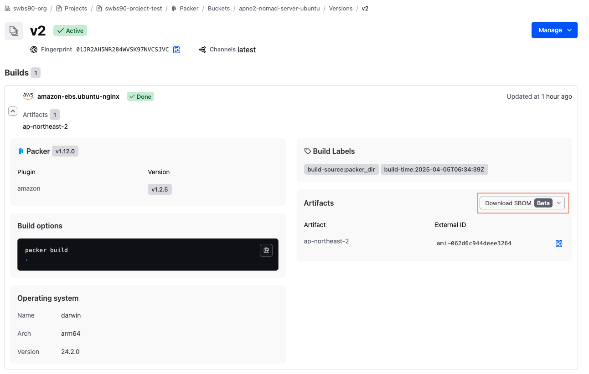

# HCP Packer UI 

HCP Packer SBOM UI 화면입니다:



---

# SBOM 예시

아래는 SBOM 예시입니다:

```json
{
  "$schema": "http://cyclonedx.org/schema/bom-1.6.schema.json",
  "bomFormat": "CycloneDX",
  "specVersion": "1.6",
  "serialNumber": "urn:uuid:3a619bd1-c113-4be2-a930-eb3c0cd4cb0a",
  "version": 1,
  "metadata": {
    "timestamp": "2025-04-05T06:39:33Z",
    "tools": {
      "components": [
        {
          "type": "application",
          "author": "anchore",
          "name": "syft",
          "version": "1.22.0"
        }
      ]
    },
    "component": {
      "bom-ref": "af63bd4c8601b7f0",
      "type": "file",
      "name": "/"
    }
  },
``` 