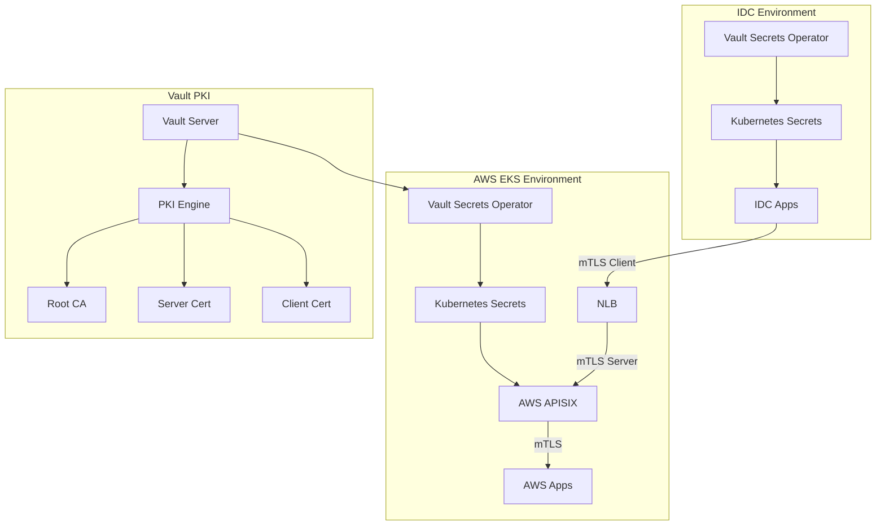

# APISIX PKI Secrets Management

이 디렉토리는 HashiCorp Vault PKI를 활용한 APISIX Gateway mTLS 통신을 위한 인증서 관리 가이드를 제공합니다.

## 📋 목차

- [개요](#개요)
- [아키텍처](#아키텍처)
- [Vault PKI 구성](#vault-pki-구성)
- [Kubernetes 시크릿 관리](#kubernetes-시크릿-관리)
- [APISIX mTLS 설정](#apisix-mtls-설정)
- [배포 가이드](#배포-가이드)
- [테스트 및 검증](#테스트-및-검증)
- [트러블슈팅](#트러블슈팅)

## 개요

AWS와 Site 간 APISIX Gateway mTLS 통신을 위한 PKI 인증서 관리 솔루션입니다. Vault PKI 엔진과 Vault Secrets Operator (VSO)를 활용하여 자동화된 인증서 발급, 갱신, 배포를 구현합니다.

### 🎯 주요 기능

- **양방향 mTLS 통신**: AWS ↔ Site 간 안전한 통신
- **자동화된 인증서 관리**: VSO를 통한 자동 발급 및 갱신
- **역할 기반 인증**: 서버/클라이언트 역할별 분리된 인증서
- **gRPC 지원**: 양방향 gRPC 스트림 통신 지원
- **보안 강화**: 짧은 TTL과 용도 제한을 통한 보안 강화

## 아키텍처



### 🔄 통신 흐름

1. **Site APISIX** → **AWS APISIX** (mTLS 클라이언트)
2. **AWS APISIX** → **AWS Apps** (mTLS 서버)
3. **Vault PKI** → **VSO** → **Kubernetes Secrets** (인증서 자동 관리)

## Vault PKI 구성

### 📁 디렉토리 구조

```
vault-secret/api-gateway-pki/
├── README.md                    # 이 파일
├── secret-terraform/            # Terraform PKI 설정
│   ├── main.tf                 # PKI 엔진 및 역할 정의
│   ├── variables.tf            # 변수 정의
│   └── outputs.tf              # AppRole 출력값
└── vso-kubernetes/             # VSO Kubernetes 리소스
    ├── vault-connection.yaml   # Vault 연결 설정
    ├── vaultauth-server.yaml    # AWS 서버 인증
    ├── vaultauth-client.yaml   # Site 클라이언트 인증
    ├── vault-pki-secrets.yaml       # PKI 시크릿 정의
    └── create-ca-secret.sh          # CA 인증서 생성 스크립트
```

### 🔐 PKI 역할 정의

#### 1. AWS APISIX Server Role
```hcl
resource "vault_pki_secret_backend_role" "apisix_aws_server" {
  backend = vault_mount.gw_pki.path
  name    = "api-gateway-server"
  
  # 서버 인증서용 설정
  allowed_domains = ["{your-domain}", "api-gateway.default.svc"]
  allow_subdomains = true
  allow_any_name = false
  
  # 인증서 용도 제한
  server_flag = true
  client_flag = false
  
  # TTL 설정
  ttl = "24h"
  max_ttl = "8760h"  # 1년
}
```

#### 2. Site APISIX Client Role
```hcl
resource "vault_pki_secret_backend_role" "apisix_site_client" {
  backend = vault_mount.gw_pki.path
  name    = "api-gateway-client"
  
  # 클라이언트 인증서용 설정
  allowed_domains = ["gateway-client", "external-gateway-client"]
  allow_subdomains = true
  allow_any_name = false
  
  # 인증서 용도 제한
  server_flag = false
  client_flag = true
  
  # TTL 설정
  ttl = "24h"
  max_ttl = "8760h"  # 1년
}
```

### 🔑 AppRole 인증 설정

각 환경별로 분리된 AppRole을 생성하여 보안을 강화합니다:

```hcl
# AWS 서버용 AppRole
resource "vault_approle_auth_backend_role" "aws_server" {
  backend = vault_auth_backend.gw_pki.path
  role_name = "server"
  
  token_policies = ["api-gateway-pki-server-policy"]
  token_ttl = "20m"
  token_max_ttl = "1h"
}

# Site 클라이언트용 AppRole  
resource "vault_approle_auth_backend_role" "site_client" {
  backend = vault_auth_backend.gw_pki.path
  role_name = "client"
  
  token_policies = ["api-gateway-pki-client-policy"]
  token_ttl = "20m"
  token_max_ttl = "1h"
}
```

## Kubernetes 시크릿 관리

### 🔄 VSO를 통한 자동화

Vault Secrets Operator를 사용하여 인증서를 자동으로 Kubernetes 시크릿으로 동기화합니다.

#### 1. Vault 연결 설정
```yaml
apiVersion: secrets.hashicorp.com/v1beta1
kind: VaultConnection
metadata:
  name: vault-connection
  namespace: default
spec:
  address: "https://{your-vault-server}"
  headers:
    X-Vault-Namespace: "admin"
```

#### 2. AWS 서버 인증서
```yaml
apiVersion: secrets.hashicorp.com/v1beta1
kind: VaultPKISecret
metadata:
  name: api-gateway-server-cert
  namespace: default
spec:
  vaultAuthRef: api-gateway-pki-server-auth
  mount: api-gateway-pki
  role: apisix-server
  commonName: {your-domain}
  altNames:
    - {your-domain}
    - apisix-gateway.default.svc.cluster.local
    - grpc-service-mtls.default.svc.cluster.local
    - localhost
  ttl: 24h
  destination:
    name: api-gateway-server-tls
    create: true
    type: kubernetes.io/tls
```

#### 3. Site 클라이언트 인증서
```yaml
apiVersion: secrets.hashicorp.com/v1beta1
kind: VaultPKISecret
metadata:
  name: gateway-client-cert
  namespace: default
spec:
  vaultAuthRef: api-gateway-pki-client-auth
  mount: api-gateway-pki
  role: apisix-client
  commonName: gateway-client
  altNames:
    - gateway-client
    - external-gateway-client
    - localhost
  ttl: 24h
  destination:
    name: gateway-client-tls
    create: true
    type: kubernetes.io/tls
```

### 📦 생성되는 시크릿

| 시크릿 이름 | 용도 | 타입 | TTL |
|------------|------|------|-----|
| `api-gateway-pki-ca-cert` | Root CA 인증서 | Opaque | 수동 갱신 |
| `api-gateway-server-tls` | AWS APISIX 서버 인증서 | kubernetes.io/tls | 24시간 |
| `gateway-client-tls` | Site APISIX 클라이언트 인증서 | kubernetes.io/tls | 24시간 |

## APISIX mTLS 설정

### 🚀 Helm Values 설정

APISIX에 mTLS 인증서를 마운트하고 설정합니다:

```yaml
# APISIX mTLS 서버 설정
image:
  repository: apache/apisix
  tag: 3.13.0-ubuntu

# Vault PKI 인증서 볼륨 마운트
extraVolumes:
  - name: server-tls-certs
    secret:
      secretName: api-gateway-server-tls
  - name: ca-cert
    secret:
      secretName: api-gateway-pki-ca-cert

extraVolumeMounts:
  - name: server-tls-certs
    mountPath: /opt/apisix/ssl
    readOnly: true
  - name: ca-cert
    mountPath: /opt/apisix/ca
    readOnly: true

# APISIX SSL 설정
apisix:
  ssl:
    enabled: true  # mTLS 활성화
  
  plugins:
    - grpc-transcode
    - grpc-web
    - prometheus
    - cors
    - jwt-auth
    - key-auth

# NLB 설정 (AWS)
service:
  type: LoadBalancer
  annotations:
    service.beta.kubernetes.io/aws-load-balancer-type: "external"
    service.beta.kubernetes.io/aws-load-balancer-nlb-target-type: "ip"
    service.beta.kubernetes.io/aws-load-balancer-scheme: "internet-facing"
    external-dns.alpha.kubernetes.io/hostname: "{your-domain}"
```

### 🔧 gRPC 라우팅 설정

APISIX Admin API를 통해 gRPC 라우트를 설정합니다:

```bash
# gRPC 라우트 등록
curl -X PUT "http://localhost:9180/apisix/admin/routes/grpc-service-simple" \
-H "X-API-KEY: {your-apisix-admin-key}" \
-d '{
  "name": "grpc-service-simple",
  "uri": "/*",
  "upstream": {
    "scheme": "grpc",
    "nodes": {"grpc-service-mtls.default.svc.cluster.local:9001": 1}
  }
}'
```

### 🛡️ mTLS 보안 설정

#### 서버 측 (AWS APISIX)
```yaml
# APISIX SSL 설정
ssl:
  cert: /opt/apisix/ssl/tls.crt
  key: /opt/apisix/ssl/tls.key
  client_ca: /opt/apisix/ca/ca_certificate
  verify_client: true  # 클라이언트 인증서 검증
```

## 배포 가이드

### 1️⃣ Terraform 배포

```bash
# PKI 엔진 및 역할 생성
cd secret-terraform/
terraform init
terraform plan
terraform apply

# AppRole 정보 확인
terraform output aws_server_approle_role_id
terraform output -raw aws_server_approle_secret_id
terraform output site_client_approle_role_id
terraform output -raw site_client_approle_secret_id
```

### 2️⃣ VSO Kubernetes 리소스 배포

```bash
cd vso-kubernetes/

# Vault 연결 설정
kubectl apply -f vault-connection.yaml

# AWS 서버 인증 설정
kubectl apply -f vaultauth-server.yaml

# Site 클라이언트 인증 설정 (Site 클러스터에서)
kubectl apply -f vaultauth-client.yaml

# PKI 시크릿 생성
kubectl apply -f vault-pki-secrets.yaml

# CA 인증서 생성 (수동)
./create-ca-secret.sh
```

### 3️⃣ APISIX 배포

```bash
# Helm 차트 설치
helm install apisix apisix/apisix \
  -n default \
  -f override-values-mtls-server.yaml

# APISIX Ingress Controller 설치
helm install apisix-ingress-controller apisix/apisix-ingress-controller \
  -n default \
  --set config.apisix.serviceNamespace=default \
  --set config.apisix.adminKey={your-apisix-admin-key}
```

### 4️⃣ gRPC 애플리케이션 배포

```bash
# grpc-service mTLS 설정 배포
kubectl apply -f grpc-service-mtls-config.yaml

# Gateway API 리소스 배포
kubectl apply -f apisix-gateway.yaml

# 라우트 설정
kubectl apply -f apisix-mtls-routes.yaml
```

## 테스트 및 검증

### 🔍 인증서 상태 확인

```bash
# VSO 상태 확인
kubectl get vaultpkisecret -n default
kubectl get vaultauth -n default

# 시크릿 확인
kubectl get secret -n default | grep -E "(api-gateway)"

# 인증서 내용 확인
kubectl get secret api-gateway-server-tls -n default -o jsonpath='{.data.tls\.crt}' | base64 -d | openssl x509 -text -noout
```

### 🧪 이중 인증 통신 테스트

#### 1. 외부 클라이언트 시뮬레이션 테스트

다음 Job을 실행하여 Site App에서 AWS APISIX로의 이중 인증(mTLS + API Key) 테스트를 수행합니다:

```yaml
apiVersion: batch/v1
kind: Job
metadata:
  name: test-external-dual-auth
  namespace: default
spec:
  template:
    spec:
      containers:
      - name: curl-test
        image: curlimages/curl:latest
        command: ["/bin/sh"]
        args: [
          "-c",
          "echo '=== 외부 Site App 시뮬레이션 테스트 ===' && echo 'Flow: Site App(mTLS+API Key) -> NLB -> APISIX -> grpc-service-mtls' && echo && echo '=== API Key 없이 테스트 (401 예상) ===' && curl -v --http2 --cacert /etc/ca/ca_certificate --cert /etc/tls/tls.crt --key /etc/tls/tls.key -H 'Content-Type: application/grpc' -d '' https://api-gateway.example.com:443/grpcservice.GRPCService/Empty && echo && echo '=== 클라이언트 인증서 없이 테스트 (TLS 실패 예상) ===' && curl -v --http2 -k -H 'apikey: site-app-secret-key-2025' -H 'Content-Type: application/grpc' -d '' https://api-gateway.example.com:443/grpcservice.GRPCService/Empty && echo && echo '=== 완전한 이중 인증 테스트 (성공 예상) ===' && curl -v --http2 --cacert /etc/ca/ca_certificate --cert /etc/tls/tls.crt --key /etc/tls/tls.key -H 'apikey: site-app-secret-key-2025' -H 'Content-Type: application/grpc' -d '' https://api-gateway.example.com:443/grpcservice.GRPCService/Empty && echo && echo '=== 이중 인증 테스트 완료! ==='"
        ]
        volumeMounts:
        - name: client-tls-certs
          mountPath: /etc/tls
          readOnly: true
        - name: ca-cert
          mountPath: /etc/ca
          readOnly: true
      volumes:
      - name: client-tls-certs
        secret:
          secretName: api-gateway-client-tls
      - name: ca-cert
        secret:
          secretName: api-gateway-ca-cert
      restartPolicy: Never
```

#### 2. 테스트 실행

```bash
# 이중 인증 테스트 Job 실행
kubectl apply -f test-external-dual-auth.yaml

# 테스트 로그 확인
kubectl logs -n default job/test-external-dual-auth

# Job 정리
kubectl delete job test-external-dual-auth -n default
```

#### 3. 테스트 시나리오

**시나리오 1: API Key 없이 테스트 (401 예상)**
```bash
curl -v --http2 \
  --cacert /etc/ca/ca_certificate \
  --cert /etc/tls/tls.crt \
  --key /etc/tls/tls.key \
  -H 'Content-Type: application/grpc' \
  -d '' \
  https://{your-domain}:443/grpcservice.GRPCService/Empty
```

**시나리오 2: 클라이언트 인증서 없이 테스트 (TLS 실패 예상)**
```bash
curl -v --http2 -k \
  -H 'apikey: {your-api-key}' \
  -H 'Content-Type: application/grpc' \
  -d '' \
  https://{your-domain}:443/grpcservice.GRPCService/Empty
```

**시나리오 3: 완전한 이중 인증 테스트 (성공 예상)**
```bash
curl -v --http2 \
  --cacert /etc/ca/ca_certificate \
  --cert /etc/tls/tls.crt \
  --key /etc/tls/tls.key \
  -H 'apikey: {your-api-key}' \
  -H 'Content-Type: application/grpc' \
  -d '' \
  https://{your-domain}:443/grpcservice.GRPCService/Empty
```

### 🧪 gRPC 통신 테스트

```bash
# gRPC 서비스 목록 조회
grpcurl -plaintext localhost:8080 list

# gRPC 메소드 호출
grpcurl -plaintext localhost:8080 grpcservice.GRPCService/Index

# mTLS gRPC 테스트 (클라이언트 인증서 사용)
grpcurl -cert /path/to/client.crt -key /path/to/client.key -cacert /path/to/ca.crt \
  localhost:8080 grpcservice.GRPCService/Index
```

### 📊 APISIX 상태 확인

```bash
# APISIX Pod 상태
kubectl get pods -n default | grep apisix

# 인증서 마운트 확인
kubectl exec -n default deployment/apisix -- ls -la /opt/apisix/ssl/

# 라우트 설정 확인
curl -H "X-API-KEY: {your-apisix-admin-key}" \
  "http://localhost:9180/apisix/admin/routes"
```

### 🔐 이중 인증 설정 확인

#### API Key 인증 설정
```bash
# API Key 플러그인 설정 확인
curl -H "X-API-KEY: {your-apisix-admin-key}" \
  "http://localhost:9180/apisix/admin/routes/grpc-service-simple" | jq '.data.value.plugins.key-auth'
```

#### mTLS 설정 확인
```bash
# SSL 인증서 설정 확인
kubectl exec -n default deployment/apisix -- cat /opt/apisix/ssl/tls.crt | openssl x509 -text -noout

# CA 인증서 확인
kubectl exec -n default deployment/apisix -- cat /opt/apisix/ca/ca_certificate | openssl x509 -text -noout
```