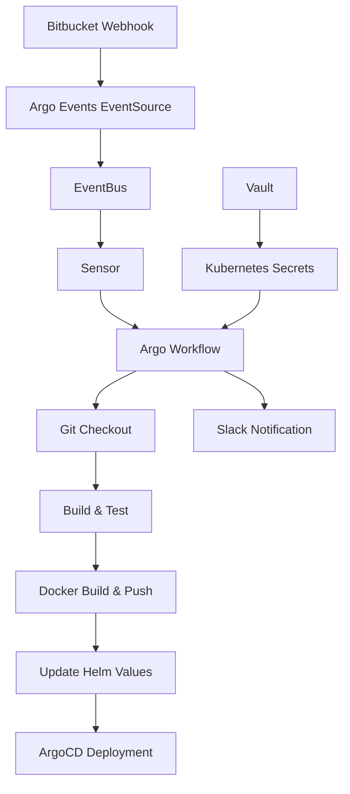

# Argo Workflows Secrets Management

이 디렉토리는 Argo Workflows와 Argo Events를 활용한 CI/CD 파이프라인에서 사용되는 시크릿 관리에 대한 가이드를 제공합니다.

## 📋 목차

- [개요](#개요)
- [아키텍처](#아키텍처)
- [시크릿 구조](#시크릿-구조)
- [Helm Chart 구성](#helm-chart-구성)
- [워크플로우 템플릿](#워크플로우-템플릿)
- [배포 가이드](#배포-가이드)
- [트러블슈팅](#트러블슈팅)

## 개요

Bitbucket 웹훅을 통한 자동화된 CI/CD 파이프라인을 구축하기 위한 Argo Events와 Argo Workflows 통합 솔루션입니다. 각 리포지토리별로 개별적인 시크릿과 워크플로우를 관리하며, Vault를 통한 안전한 시크릿 관리를 지원합니다.

### 🎯 주요 기능

- **자동화된 CI/CD**: Bitbucket push 이벤트 기반 자동 빌드/배포
- **리포지토리별 격리**: 각 프로젝트별 독립적인 시크릿 및 워크플로우 관리
- **Slack 알림**: 빌드 상태에 대한 실시간 Slack 알림
- **GitOps 통합**: Helm values 자동 업데이트를 통한 GitOps 워크플로우

## 아키텍처



### 🔄 워크플로우 단계

1. **Bitbucket Webhook** → Bitbucket에서 push 이벤트 발생
2. **Argo Events** → EventSource가 웹훅 수신 및 EventBus로 전달
3. **Sensor** → 리포지토리별 필터링 후 워크플로우 트리거
4. **Argo Workflows** → 다음 단계 순차 실행:
   - Git 체크아웃
   - 빌드 및 테스트
   - Docker 이미지 빌드 & ECR 푸시
   - GitOps 리포지토리의 Helm values 업데이트
5. **ArgoCD** → Git 변경사항 감지 후 자동 배포
6. **Slack 알림** → 빌드 결과 알림

## 시크릿 구조

각 애플리케이션별로 다음과 같은 시크릿이 필요합니다:

### 📦 기본 시크릿 템플릿

```yaml
apiVersion: v1
kind: Secret
metadata:
  name: {app-name}
  namespace: argocd
type: Opaque
data:
  # Bitbucket 인증
  bitbucket-username: {base64-encoded}
  bitbucket-app-password: {base64-encoded}
  bitbucket-email: {base64-encoded}
  
  # AWS ECR 인증
  aws-access-key-id: {base64-encoded}
  aws-secret-access-key: {base64-encoded}
  aws-default-region: {base64-encoded}
  
  # 컨테이너 레지스트리
  ecr-url: {base64-encoded}
  
  # GitOps 리포지토리
  infra-repo: {base64-encoded}
  
  # Slack 알림
  slack-token: {base64-encoded}
```

### 🔐 Vault 통합

Vault를 사용하는 경우, [Vault Secrets Operator](../hcp_vault_secrets/vso/)를 통해 시크릿을 자동으로 동기화할 수 있습니다:

```yaml
apiVersion: secrets.hashicorp.com/v1beta1
kind: VaultStaticSecret
metadata:
  name: {app-name}-vault-secret
  namespace: argocd
spec:
  type: kv-v2
  mount: kvv2
  path: argo-workflows/{app-name}
  destination:
    name: {app-name}
    create: true
  refreshAfter: 30s
```

## Helm Chart 구성

### 📁 디렉토리 구조

```
helm-dev-argo-webhook/
├── Chart.yaml                          # Helm 차트 메타데이터
├── values.yaml                         # 기본 설정값
├── templates/                          # 공통 인프라 템플릿
│   ├── eventbus.yaml                  # 이벤트 버스
│   ├── eventsource.yaml               # 웹훅 엔드포인트
│   ├── ingress.yaml                   # 외부 접근 설정
│   └── *-rbac.yaml                    # 권한 설정
├── common-template/                    # 공통 워크플로우 템플릿
│   ├── notify-workflowtemplate.yaml   # Slack 알림 템플릿
│   └── update-helm-values-workflowtemplate.yaml
└── {app-name}/                        # 앱별 설정
    ├── sensor-{app-name}.yaml         # 이벤트 센서
    ├── workflowtemplate-{app-name}.yaml # 워크플로우 템플릿
    └── parameter-secret-{app-name}.yaml # 파라미터 시크릿
```

### ⚙️ 주요 설정 (values.yaml)

```yaml
namespace: argocd

webhook:
  eventName: webhook
  name: bitbucket
  path: /bitbucket-push
  port: 12000
  host: argo-wf-evnet.com

eventBus:
  name: default
  replicas: 1

serviceAccount:
  name: default
```

## 워크플로우 템플릿

### 🔧 메인 워크플로우 구조

각 애플리케이션의 워크플로우 템플릿은 다음과 같은 DAG 구조를 가집니다:

```yaml
templates:
  - name: main
    dag:
      tasks:
      - name: checkout          # Git 소스코드 체크아웃
        template: git-checkout
      - name: build-test        # 빌드 및 테스트
        template: build-test
        dependencies: [checkout]
      - name: docker-build-push # Docker 이미지 빌드 & 푸시
        template: docker-build-push
        dependencies: [build-test]
      - name: update-helm-values # GitOps 리포지토리 업데이트
        templateRef:
          name: update-helm-values-workflowtemplate
          template: update-helm-values
        dependencies: [docker-build-push]
```

### 📨 Slack 알림 템플릿

공통 알림 템플릿 (`notify-workflowtemplate`)을 통해 빌드 상태를 Slack으로 전송:

```yaml
# 사용 예시
- name: notify-success
  templateRef:
    name: notify-workflowtemplate
    template: notify
  arguments:
    parameters:
      - name: title
        value: "✅ Build Succeeded"
      - name: status
        value: "Succeeded"
      - name: repo
        value: "{{workflow.parameters.repo-name}}"
```

### 🎛️ 센서 설정

각 리포지토리별 센서는 특정 조건에서만 워크플로우를 트리거합니다:

```yaml
dependencies:
  - name: bitbucket-push-dep
    eventSourceName: bitbucket
    eventName: webhook
    filters:
      data:
        - path: body.repository.name
          type: string
          value: ["{repository-name}"]        
        - path: body.push.changes.0.new.name
          type: string
          value: ["main"]  # main 브랜치만 트리거
```

## 배포 가이드

### 1️⃣ 공통 인프라 배포

```bash
# Helm 차트 설치
helm install bitbucket-argo-events ./helm-dev-argo-webhook -n argocd

# 또는 values 파일로 커스터마이징
helm install bitbucket-argo-events ./helm-dev-argo-webhook \
  -n argocd \
  -f custom-values.yaml
```

### 2️⃣ 애플리케이션별 리소스 배포

```bash
# 시크릿 생성 (Vault 사용하지 않는 경우)
kubectl apply -f {app-name}/parameter-secret-{app-name}.yaml

# 워크플로우 템플릿 배포
kubectl apply -f {app-name}/workflowtemplate-{app-name}.yaml

# 센서 배포
kubectl apply -f {app-name}/sensor-{app-name}.yaml
```

### 3️⃣ Bitbucket 웹훅 설정

Bitbucket 리포지토리 설정에서 다음 URL로 웹훅 추가:

```
https://argo-wf-evnet.com/bitbucket-push
```

**웹훅 설정 옵션:**
- **Trigger**: Repository push
- **URL**: 위 엔드포인트
- **Method**: POST
- **Content-Type**: application/json

### 4️⃣ 새 애플리케이션 추가

1. **시크릿 생성**:
   ```bash
   # Vault 사용 시
   vault kv put kvv2/argo-workflows/{new-app} \
     bitbucket-username="username" \
     bitbucket-app-password="password" \
     # ... 기타 필요한 시크릿
   
   # 직접 생성 시
   kubectl create secret generic {new-app} \
     --from-literal=bitbucket-username="username" \
     --from-literal=bitbucket-app-password="password" \
     # ... 기타 시크릿
     -n argocd
   ```

2. **워크플로우 템플릿 복사 및 수정**:
   ```bash
   cp demo-koa-backend/workflowtemplate-demo-koa-backend.yaml \
      {new-app}/workflowtemplate-{new-app}.yaml
   
   # 템플릿 내 이름 및 시크릿 참조 수정
   sed -i 's/demo-koa-backend/{new-app}/g' \
      {new-app}/workflowtemplate-{new-app}.yaml
   ```

3. **센서 복사 및 수정**:
   ```bash
   cp demo-koa-backend/sensor-demo-koa-backend.yaml \
      {new-app}/sensor-{new-app}.yaml
   
   # 리포지토리 이름 필터 수정
   sed -i 's/demo-koa-backend/{new-app}/g' \
      {new-app}/sensor-{new-app}.yaml
   ```

4. **배포**:
   ```bash
   kubectl apply -f {new-app}/
   ```