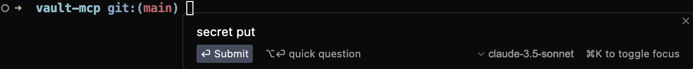
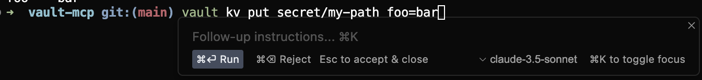
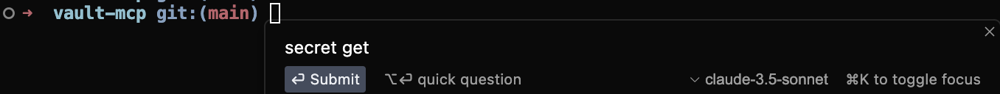
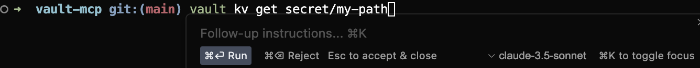
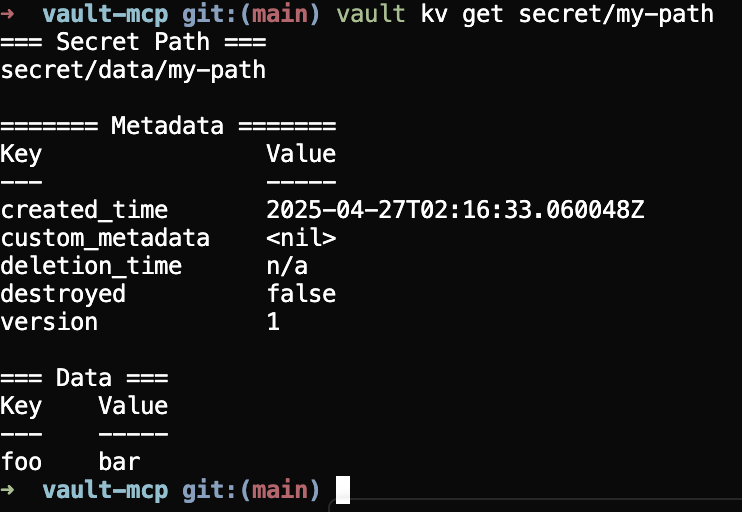
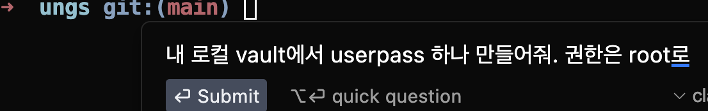
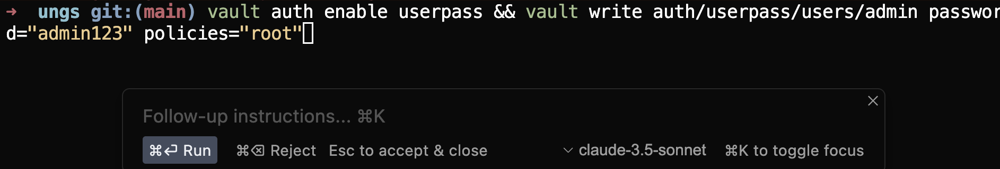
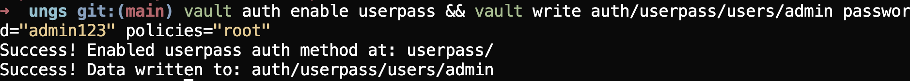

# Vault MCP Server 테스트

📦 목적
- Cursor를 통해 Vault의 Key/Value를 생성하고 찾아오는 것이 가능한 것 확인
- 권한은 현재 root로 하기때문에 추후 권한 테스트 필요

## Vault MCP 참고 Repository
- https://github.com/ashgw/vault-mcp

## 환경 설정
1. Vault Server는 로컬에서 동작 할 수 있는 Dev Mode 사용
2. MCP Server 또한 로컬에서 기동

- Vault Server, MCP Start

```bash
# Vault DEV Server Start
vault server -dev

...
    $ export VAULT_ADDR='http://127.0.0.1:8200'

The unseal key and root token are displayed below in case you want to
seal/unseal the Vault or re-authenticate.

Unseal Key: 111
Root Token: 111
...
```

- Cursor Settings

```json
{
  "mcpServers": {
    "vault": {
      "command": "docker",
      "args": [
        "run",
        "-i",
        "--rm",
        "-e",
        "VAULT_URL",
        "-e",
        "VAULT_TOKEN",
        "matthewschuchard/vault-mcp-server"
      ],
      "env": {
        "VAULT_URL": "<VAULT SERVER CLUSTER URL>",
        "VAULT_TOKEN": "<VAULT AUTHENTICATION TOKEN>"
      }
    }
  }
}
```

## Cursor에서 동작 테스트

- secret을 enable하거나 approle에 대한 기본 설정을 하는등 아직 여러 테스트를 더 해봐야 합니다.
- 아래는 KV를 Put하고 Get하는 테스트의 결과입니다.

### Put 테스트
- 
- 

### Get 테스트
- 
- 
- 

### Userpass 생성 테스트
- 
- 
- 